# MolaGPT Mobile

MolaGPT Mobile 是 [MolaGPT](https://chatgpt.wljay.cn) 的原生 Android 客户端，使用 Kotlin 与 Jetpack Compose 构建。除了连接 MolaGPT 账户，也支持接入 OpenAI 兼容、OpenAI Responses、Anthropic 和 Gemini 等自定义模型服务，并在移动端管理对话、工具、记忆、角色、世界书和图像工作台，还可以远程接管桌面端 Agent 会话。

安装包可在 [Releases](https://github.com/MOLAaaaaaaa/MolaGPT.Mobile/releases) 下载，支持 Android 6.0 及以上的 arm64 设备。

## 截图

<table>
  <tr>
    <td align="center">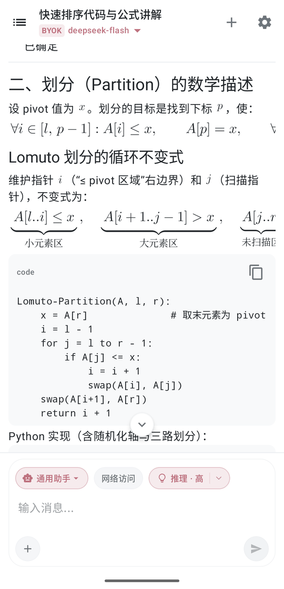<br><sub>公式与代码渲染</sub></td>
    <td align="center">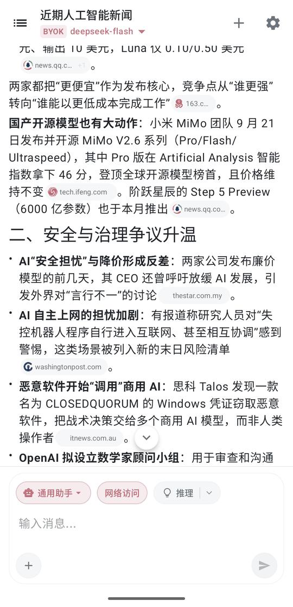<br><sub>联网搜索与来源角标</sub></td>
    <td align="center">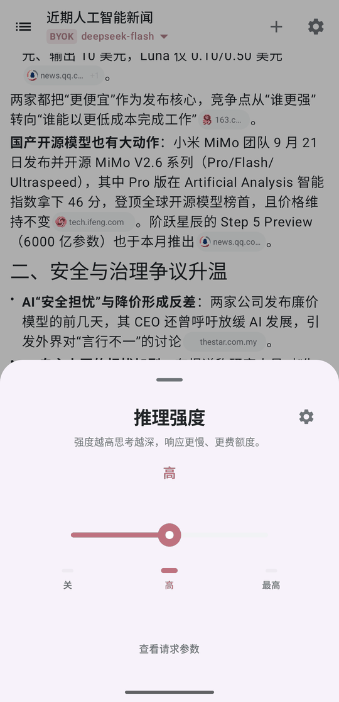<br><sub>推理强度</sub></td>
    <td align="center">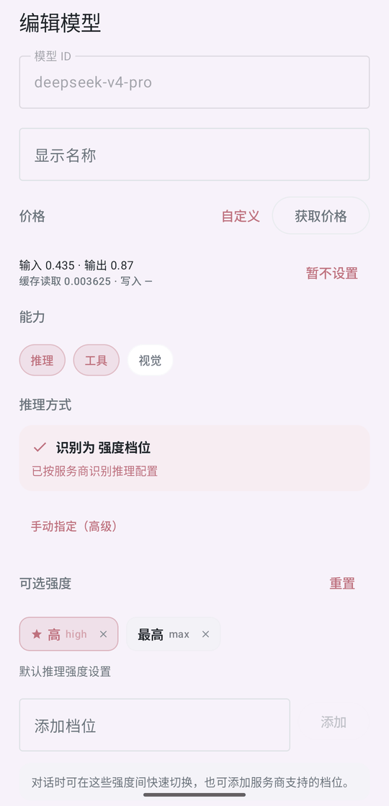<br><sub>模型价格与推理配置</sub></td>
  </tr>
  <tr>
    <td align="center">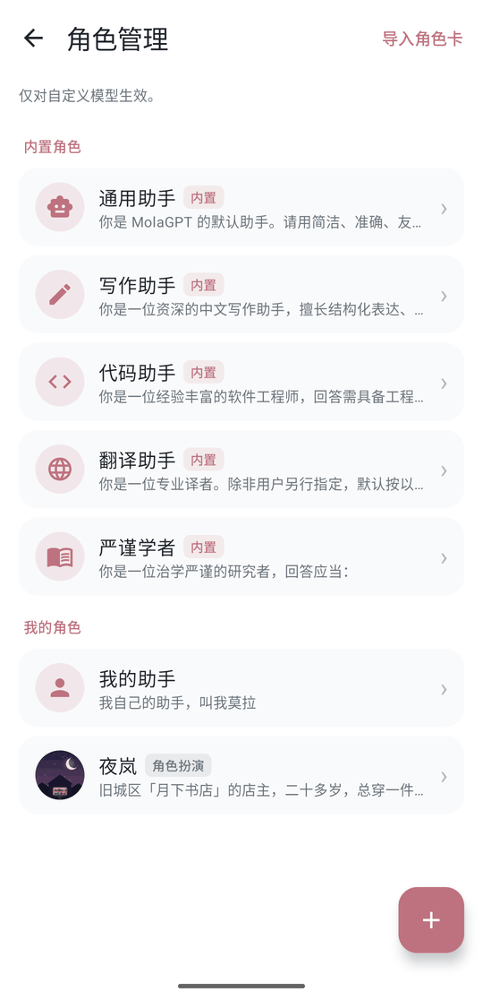<br><sub>角色管理</sub></td>
    <td align="center">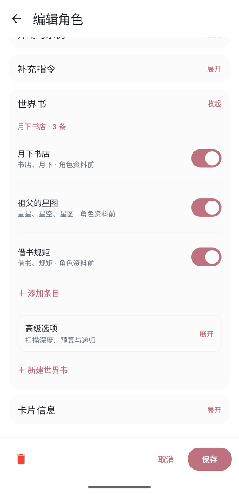<br><sub>角色卡与世界书</sub></td>
    <td align="center">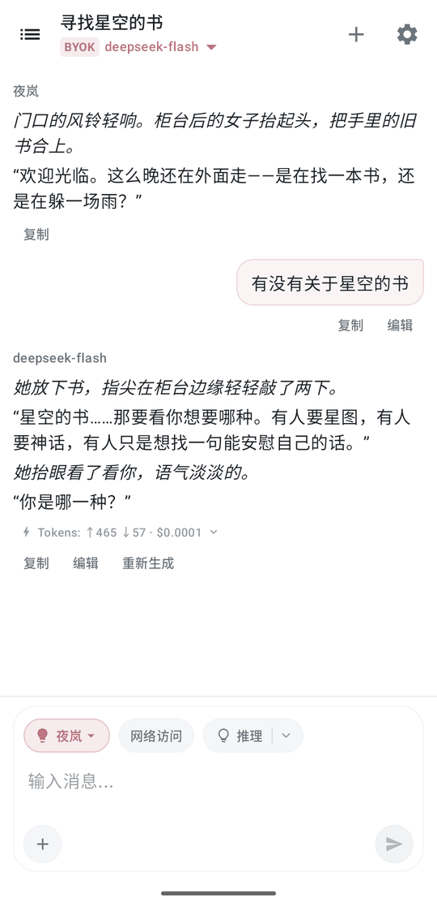<br><sub>角色扮演</sub></td>
    <td align="center">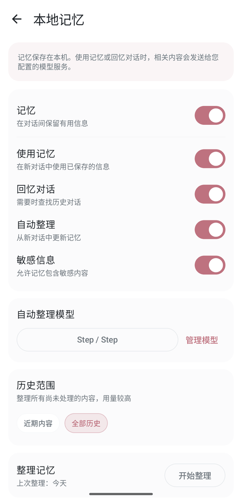<br><sub>本地记忆</sub></td>
  </tr>
  <tr>
    <td align="center">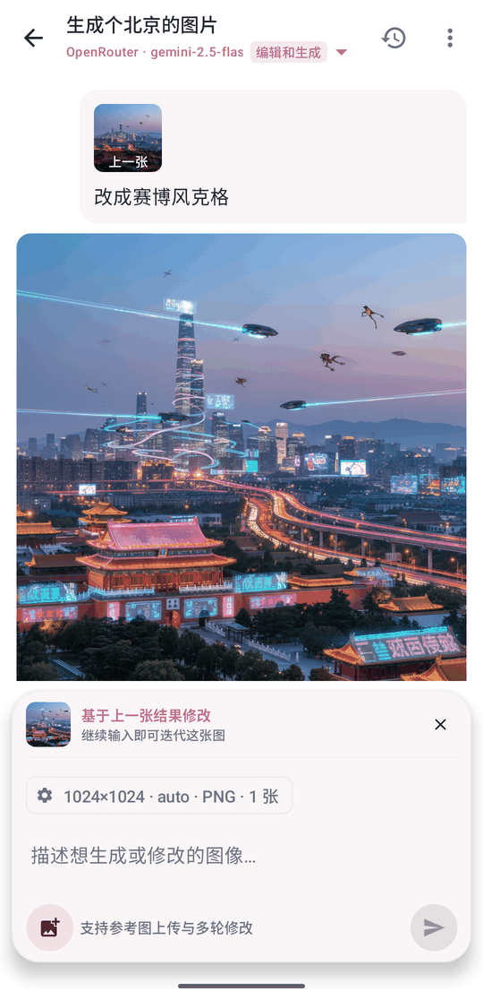<br><sub>抹茶画图工作台</sub></td>
    <td align="center">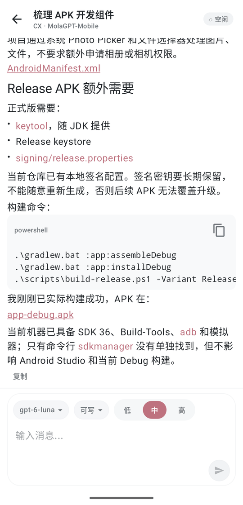<br><sub>Agent 控制</sub></td>
    <td align="center">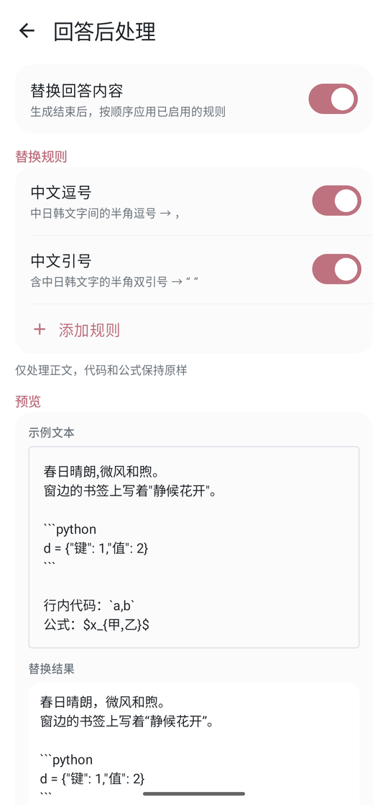<br><sub>回答后处理</sub></td>
    <td align="center">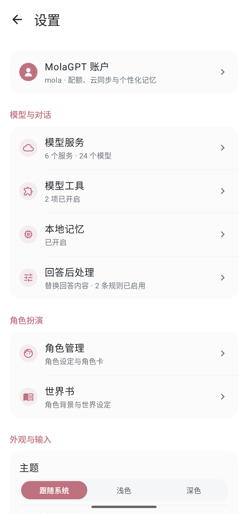<br><sub>设置</sub></td>
  </tr>
</table>

## 功能特性

### 对话体验

- 原生 Compose 界面，支持浅色、深色和跟随系统主题。
- 流式 Markdown 渲染，支持代码块、表格、数学公式、图片、思考过程和工具调用状态。
- 可视化回答（自定义模型）：函数图像、图表、可排序表格、指标卡原生绘制，可拖动读数、全屏缩放、导出图片；整页网页以卡片显示，点「运行」在隔离沙盒中打开。
- 联网搜索过程合并展示，回答中以来源角标标注引用，点按即可查看来源。
- 可按对话调节推理强度，自动识别各服务商的推理参数，也可为模型手动指定档位。
- 支持编辑已发送的消息并在编辑分支间切换；重新生成会保留历史版本，助手回答也可直接修改。
- 每条回答可查看 Token 用量、首字延迟、生成速度和花费，并累计当前对话的总花费。
- 附件支持拍照、图片和文件，PDF、Word 及各类文本文件在本机提取文字后发送。
- 会话抽屉支持按标题和本地对话内容搜索、批量删除，对话标题自动生成。
- 后台流式任务和完成通知；图片全屏预览、缩放与保存，兼容远程链接及 Base64/Data URL 图片。

### 模型与工具

- MolaGPT 账号登录、模型发现、额度展示和云端会话增量同步。
- BYOK 自定义模型服务，兼容 OpenAI 兼容接口、OpenAI Responses、Anthropic 及 Gemini 原生格式，密钥仅保存在本机。
- 可自动获取模型列表并批量管理，为模型标注推理、工具和视觉能力。
- 可一键获取模型价格，也可自定义输入、输出和缓存价格。
- 支持 DuckDuckGo、Tavily、Exa 联网搜索服务，以及远程 MCP 服务器，并按工具启用或停用。
- 支持视觉模型代理：文本模型不具备视觉能力时，可交由指定视觉模型理解图片。
- 支持图像生成工具，让兼容工具调用的 BYOK 模型使用独立图像服务。

### 记忆与回答处理

- 本地记忆：模型可在对话中保存或遗忘信息，并在新对话中使用；记忆按主题整理，可指定自动整理所用的模型和历史范围。
- 回忆对话：需要时检索本地历史对话，作为回答的参考。
- 每个新对话开始前都可以单独关闭记忆。
- 回答后处理：生成结束后按规则替换回答内容，代码和公式保持原样，可实时预览替换效果。
- MolaGPT 账户支持个性化记忆、用户画像和回答风格管理。

### 角色扮演

- 内置通用、写作、代码、翻译和学术角色，可新建、复制和编辑自己的角色；系统提示词支持日期、用户称呼、当前模型等变量。
- 支持导入 SillyTavern 角色卡，兼容 PNG、JSON、charX 格式，覆盖 V1 至 V3 规范。
- 保留角色卡中的人设、场景、开场白和对话示例，多条备选开场白可在对话中切换。
- 世界书按关键词触发设定片段，支持常驻条目、正则关键词、扫描深度、Token 预算和递归扫描；共享世界书可供多个角色引用。
- 会话列表直接显示每个对话使用的角色。

### 画图工作台（由 [@DisaWdcba](https://github.com/DisaWdcba) 提供）

- 原生图像生成与编辑工作台，可从对话页顶部快捷入口或模型工具设置进入。
- 兼容 OpenAI Images、OpenAI Chat Completions 图像回退及 Gemini 图像响应。
- 支持参考图、多轮修改、批量生成、蒙版局部重绘和生成参数配置。
- 支持画图历史、本地结果保存、再次生成、基于结果继续修改及 Base64 图片解析。
- 支持尺寸、质量、输出格式、图片数量、压缩率等模型相关参数。

### Agent 控制

- 在手机上查看并接管桌面端 Agent 会话，会话按电脑和项目分组，状态实时同步。
- 可远程发送消息、停止任务、新建会话，并切换模型、推理强度和权限模式。
- 桌面端的权限请求会推送到手机，可批准一次、本会话批准或拒绝。
- 终端命令、文件改动、搜索和子代理等过程以工具卡片展示。
- 等待审批、任务完成或失败时发送通知；桌面端离线时，未完成的会话会被及时标记。
- 需要登录 MolaGPT 账户，并在桌面端启用 Agent 桥接。

## 项目结构

```text
app/                    Android 应用入口、导航与后台服务
core/common/            协程、日志等通用能力
core/model/             领域模型、角色卡解析与世界书匹配
core/network/           HTTP/SSE、各服务商协议、联网搜索与 MCP
core/storage/           Room、设置、本地记忆与云同步
core/markdown/          Markdown 解析与回答后处理
core/render/            流式渲染、代码、公式与工具调用视图
feature/chat/           对话界面与流式交互
feature/session/        会话列表、搜索与历史管理
feature/settings/       设置、模型服务、记忆、角色、世界书与图像工作台
feature/agent-control/  远程 Agent 控制
feature/auth/           MolaGPT 登录
feature/file/           附件、文档解析与图片预览
feature/webview/        网页运行沙盒与 CDN 代理
feature/share/          系统分享
baselineprofile/        Baseline Profile 配置
screenshots/            README 截图
```

## 构建

需要安装 Android Studio、Android SDK 36 和 JDK 17。

构建 Debug APK：

```powershell
.\gradlew.bat :app:assembleDebug
```

构建 Release APK：

```powershell
.\gradlew.bat :app:assembleRelease
```

Release 构建启用 R8.

## 致谢

- 感谢 [DisaWdcba](https://github.com/DisaWdcba) 通过 [PR #2](https://github.com/MOLAaaaaaaa/MolaGPT.Mobile/pull/2) 贡献原生抹茶画图工作台。
- 图像工作台参考并延续了 [SimpleAIPainting](https://github.com/DisaWdcba/SimpleAIPainting) 的思路。
- Agent 控制的桥接与中继架构参考了 [Remodex](https://github.com/Emanuele-web04/remodex) 的设计。
- 使用的开源组件及许可证见应用内「关于 MolaGPT」。

欢迎通过 Issue 或 Pull Request 反馈问题和参与改进。
